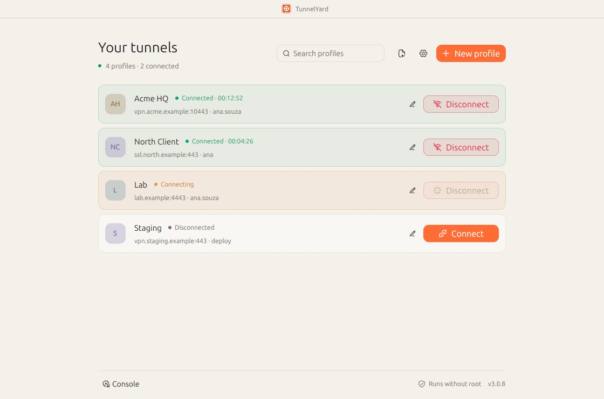

<p align="center">
  
</p>

<h1 align="center">🛡️ TunnelYard</h1>

<p align="center">
  <strong>FortiGate SSL VPN, without a root terminal left open forever.</strong><br>
  Native desktop app for Linux. Open source, the Linux way.
</p>

<p align="center">
  <a href="https://tunnelyard.lucascavalheri.com.br">Website</a>
  ·
  <a href="https://github.com/LucasCavalheri/tunnel-yard/releases/latest">Download</a>
  ·
  <a href="docs/platform-support.md">Platform notes</a>
  ·
  <a href="CHANGELOG.md">Changelog</a>
</p>

<p align="center">
  <a href="https://github.com/LucasCavalheri/tunnel-yard/releases/latest"></a>
  <a href="./LICENSE"></a>
  
  
</p>

<p align="center">
  <picture>
    <source media="(prefers-color-scheme: dark)" srcset="docs/screenshots/window-en-dark.webp">
    
  </picture>
</p>

TunnelYard 3 is Linux-only. It speaks **openfortivpn**, stores profiles in `/etc/openfortivpn`, and asks PolicyKit when a tunnel actually needs privilege. Connect one tunnel or several, hide the window, get a notification when a link drops, and let the app bring it back.

---

## ✨ Highlights

| | |
|---|---|
| 🔌 **Several tunnels at once** | Each profile is its own session. Bring up work, lab and a client VPN together. |
| 🎨 **Light, dark or system** | Appearance follows the OS or stays on the theme you pick. Persisted. |
| ♻️ **Auto-reconnect** | On by default. An unexpected drop starts a new tunnel; a manual disconnect does not. |
| 🔐 **Unprivileged UI** | The window never runs as root. PolicyKit only appears when a tunnel actually needs it. |
| 🧺 **Tray, not a terminal** | Close the window. The tunnels stay up. Quit only when you mean it. |
| 🌐 **pt-BR and English** | Full UI language switch, saved next to the theme. |
| 📦 **In-app updates** | Check, download and install the matching package for this machine. |

The interface is native [GPUI Kit](https://gpui-kit.com/), with Hugeicons for the icons. See [`docs/gpui-kit.md`](docs/gpui-kit.md).

---

## 🚀 Install

Grab a build from [GitHub Releases](https://github.com/LucasCavalheri/tunnel-yard/releases/latest).

| File | Distro family |
|------|----------|
| `tunnel-yard_3.0.8_amd64.deb` | Debian, Ubuntu, Mint, Pop!_OS, Kali, Raspberry Pi OS, … |
| `tunnel-yard-3.0.8-1.x86_64.rpm` | Fedora, RHEL, Rocky, Alma, openSUSE, Mageia, … |
| `tunnel-yard-3.0.8-1-x86_64.pkg.tar.zst` | Arch, Manjaro |
| `tunnel-yard-3.0.8-r0-x86_64.apk` | Alpine (needs `gcompat`) |
| `tunnel-yard-linux-x64.tar.gz` | Gentoo, Void, NixOS and anywhere else |

ARM64 files use `arm64` / `aarch64` in the name.

```bash
curl -fsSL https://tunnelyard.lucascavalheri.com.br/install.sh | bash
```

The script reads `uname` and the package manager, then installs the matching GitHub asset (deb, rpm, pacman, apk, or the portable archive). If TunnelYard is already open, it asks for confirmation, disconnects active tunnels, installs the update and relaunches the app.

```bash
# Debian / Ubuntu / Mint / Pop!_OS / Kali
sudo apt install ./tunnel-yard_3.0.8_amd64.deb

# Fedora / RHEL / Rocky / Alma
sudo dnf install ./tunnel-yard-3.0.8-1.x86_64.rpm

# Arch / Manjaro
sudo pacman -U ./tunnel-yard-3.0.8-1-x86_64.pkg.tar.zst

# Alpine
sudo apk add gcompat
sudo apk add --allow-untrusted ./tunnel-yard-3.0.8-r0-x86_64.apk

# Portable
tar -xzf tunnel-yard-linux-x64.tar.gz
chmod +x tunnel-yard-linux-x64
./tunnel-yard-linux-x64
```

`.deb`, `.rpm`, the pacman package and the apk install the desktop launcher, icons, PolicyKit action and VPN helpers. The `.tar.gz` is the same binary with the executable bit.

On first launch the app can install `openfortivpn` through the distro's own package manager (apt, dnf, yum, zypper, pacman, apk, xbps, emerge, eopkg). Immutable images (Silverblue and friends) and Nix/Guix show the command instead of running it for you.

Linux also writes `~/.local/share/applications/lucas.cavalheri.tunnelyard.desktop` so GNOME can match the Wayland app id to the branded dock icon. Packagers can copy [`packaging/tunnel-yard.desktop`](packaging/tunnel-yard.desktop).

### 🐧 Linux

Profiles live in `/etc/openfortivpn`. Connecting uses PolicyKit (`pkexec`). From source:

```bash
cargo build --release
./target/release/tunnel-yard
```

| Need | Notes |
|------|--------|
| Desktop session | GNOME, KDE, and friends |
| PolicyKit (`pkexec`) | Privileged start/stop and profile writes |
| `/etc/openfortivpn/` | Profile directory |
| `openfortivpn` | Optional at install — the app can install it |
| GPUI native libs | Only when compiling; see [`docs/gpui-kit.md`](docs/gpui-kit.md) |

If `openfortivpn` is missing, TunnelYard reads `/etc/os-release` and offers a one-click install via PolicyKit for apt, dnf, yum, zypper, pacman, apk, xbps, emerge and eopkg.

### 🔄 In-app updates

When a newer GitHub release exists, the main window, Preferences and tray item **Check for updates** offer **Download and install**. One click fetches the artifact for this OS, asks for administrator approval if needed, replaces the app and relaunches. The app checks once shortly after startup and then every six hours.

### 🏷️ Publishing a release

`main` only takes pull requests with a green `CI` check, and `v*` tags cannot be moved or deleted. Bump `version` in `Cargo.toml`, add a `CHANGELOG.md` section, merge that pull request, then tag the merge:

```bash
git switch main && git pull
git tag v3.0.8
git push origin v3.0.8
```

CI ([`.github/workflows/release.yml`](.github/workflows/release.yml)) tests, builds native packages and copies that changelog section into the GitHub release notes.

The APT repo is signed with [`packaging/tunnel-yard-archive-keyring.asc`](packaging/tunnel-yard-archive-keyring.asc). The matching private key lives only as the Actions secret `APT_SIGNING_KEY` (fingerprint `A9F137BEE74B623131071358FB0EC1D5A01262F0`).

---

## 🧰 Profiles

Standard openfortivpn configs:

```text
/etc/openfortivpn/
  ├── work.conf
  ├── client.conf
  └── lab.conf
```

**New profile** or **Import .conf** covers the options used in real FortiGate SSL setups:

| Field | Conf key |
|-------|----------|
| Host / Port | `host`, `port` |
| Username / Password | `username`, `password` |
| Trusted cert | `trusted-cert` |
| DNS / routes | `set-dns`, `set-routes` |
| Realm | `realm` (optional) |
| Persistent | `persistent` (seconds, `0` = off) |

```ini
host = vpn.example.com
port = 10443
username = alice
password = hunter2
trusted-cert = <sha256 fingerprint>
set-dns = 0
set-routes = 1
```

### 🔒 Privacy

- Credentials stay in plaintext `.conf` files in the platform profile directory (same model as CLI openfortivpn). Native directories are created with restricted access.
- The list shows host, port and username — not the password.
- Harden permissions on shared machines.
- Never commit personal `.conf` files or screenshots of real tunnels.

---

## 🎮 Use

1. Open **TunnelYard**.
2. Create, import or pick a profile.
3. Click **Connect** and approve the administrator prompt.
4. Leave **Auto-reconnect** on unless you want drops to stay down. Optionally start at login and switch PT / EN or the theme.
5. Close the window or **Hide to tray** — tunnels keep running.
6. Quit from **Quit** in Preferences or the tray.

Keyboard: `Ctrl+N` new profile, `Ctrl+W` hide to tray, `Ctrl+Q` quit, `Esc` close dialogs.

### Tray

Show window · per-profile connect/disconnect · disconnect all · refresh profiles · check for updates · quit.

---

## 🛠️ Develop

Rust **1.90+**. Linux needs the GPUI packages in [`docs/gpui-kit.md`](docs/gpui-kit.md).

```bash
git clone https://github.com/LucasCavalheri/tunnel-yard.git
cd tunnel-yard
cargo run
```

| Command | What it does |
|---------|----------------|
| `cargo run` | Desktop UI |
| `cargo run -- --hidden` | Start hidden (tray / login item) |
| `cargo run -- --smoke` | Engine/settings/profile JSON, then exit |
| `TUNNELYARD_SHOT=demo cargo run` | Made-up profiles on `.example` hosts for screenshots; nothing is read from `/etc/openfortivpn` and no tunnel is touched |
| `cargo test` | Domain tests |
| `cargo build --release` | Optimized `tunnel-yard` |

```text
tunnel-yard/
├── src/            # library + desktop binary
├── packaging/      # elevated helpers + PolicyKit
├── tests/          # cargo tests + packaging fixtures
├── site/           # Astro landing page
├── assets/icons/   # Hugeicons shipped with the app
└── public/         # app mark (PNG / ICO / SVG)
```

On Linux, connect goes through PolicyKit helpers under `/usr/lib/tunnel-yard/` after a package install. Profile writes use `pkexec install` into `/etc/openfortivpn`.

| Path | Role |
|------|------|
| `/usr/lib/tunnel-yard/run-vpn.sh` | Starts `openfortivpn` and tracks the PID |
| `/usr/lib/tunnel-yard/stop-vpn.sh` | Stops the tunnel |
| `/usr/share/polkit-1/actions/lucas.cavalheri.tunnelyard.policy` | PolicyKit action (`auth_admin_keep`) |

---

## 🧪 Tests

```bash
cargo test
./target/debug/tunnel-yard --smoke
```

Coverage includes conf round-trip, distro family detection (apt, dnf, zypper, pacman, apk, xbps, emerge, eopkg, Nix, ostree), reconnect policy, i18n parity, autostart, tray model, file pickers, and isolated Debian upgrade/repair.

---

## 🤝 Contributing

Fixes, UI polish, distro support, docs, packaging, tests and translations are welcome.

1. Fork and branch (`feat/my-idea`).
2. `cargo test` and, if you have a display, `cargo run -- --smoke`.
3. Open a PR with a clear *why*. Keep it focused.

Please include distro / desktop, app version, whether `openfortivpn` is installed, and redacted console output.

If you find a security issue, report it privately when you can — don't open a public issue with exploit details.

---

## 📄 License

[MIT](./LICENSE).

Built on [openfortivpn](https://github.com/adrienverge/openfortivpn). Linux only.

<p align="center">
  <strong>For people who just want the tunnel up. 🛡️</strong><br>
  <sub>Star the repo if it helps — it keeps the project visible.</sub>
</p>
